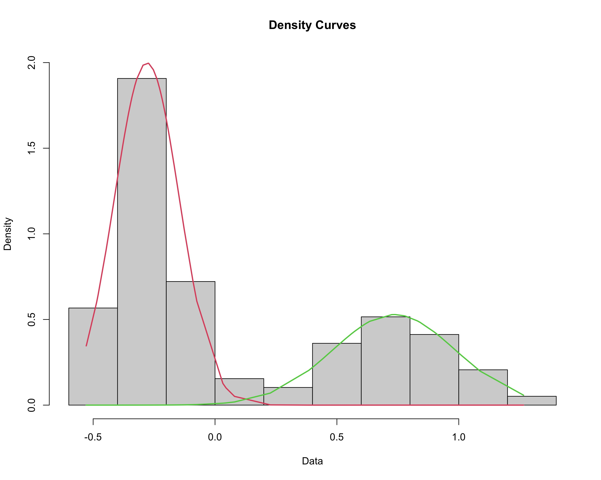
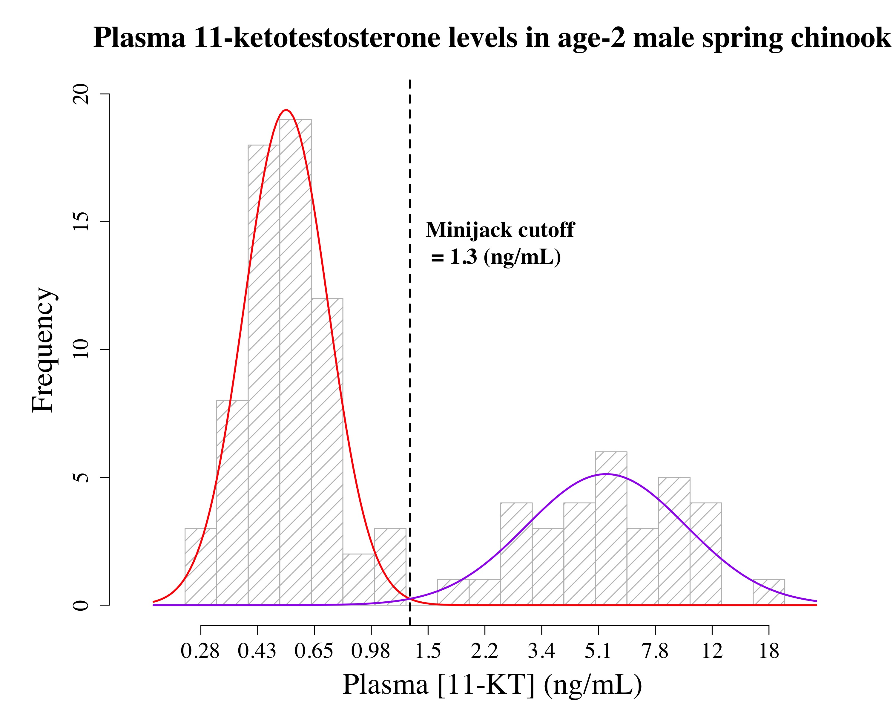

This is an R Markdown document. Markdown is a simple formatting syntax for authoring HTML, PDF, and MS Word documents. For more details on using R Markdown see <http://rmarkdown.rstudio.com>.

When you click the **Knit** button a document will be generated that includes both content as well as the output of any embedded R code chunks within the document.


### Setup RStudio
Load the packages that are used by this package.

``` r
library(mixtools)
```

```
## mixtools package, version 2.0.0, Released 2022-12-04
## This package is based upon work supported by the National Science Foundation under Grant No. SES-0518772 and the Chan Zuckerberg Initiative: Essential Open Source Software for Science (Grant No. 2020-255193).
```

``` r
library(Hmisc)
```

```
## 
## Attaching package: 'Hmisc'
```

```
## The following objects are masked from 'package:base':
## 
##     format.pval, units
```

``` r
library(plyr)
```

```
## 
## Attaching package: 'plyr'
```

```
## The following objects are masked from 'package:Hmisc':
## 
##     is.discrete, summarize
```

``` r
library(multimode)
library(readxl)
```


## Load your data
### Define your raw dataset
Specify the data file to be used in the analyses and graph (if located in R project folder, path information is not necessary). Reminder: data should be organized in as a single column of log- or natural log-transformed data without a column header.

``` r
rawdata <- "exampledata.xlsx"
```
_This step isn't necessary if you'd rather use the path name for your data._

### Import the raw dataset
Import data and remove rows containing NA data and define minimum and maximum values for the dataset.

``` r
rawdata <- read_excel(rawdata)
data_na <- na.omit(rawdata)
mydata <- data_na[[1]]
mydata.upper <- max(mydata)
mydata.lower <- min(mydata)
```
_Alternatively, you could enter the path name of your data in the read_excel function_

## Determine modality
Determine if the data is not unimodal (e.g., bimodal).

```
## Warning in modetest(mydata): A modification of the data was made in order to
## compute the excess mass or the dip statistic
```

```
## 
## 	Ameijeiras-Alonso et al. (2019) excess mass test
## 
## data:  mydata
## Excess mass = 0.098452, p-value = 0.004
## alternative hypothesis: true number of modes is greater than 1
```


```
## [1] "**Reject null hypothesis**, accept alternative hypothesis. Proceed with analyses."
```
_Returns excess mass statistic and p-value. If the p-value is less than 0.05, accept the alternative hypothesis and proceed with analysis. However, if the p-value is more than 0.05, the data is unimodal and the following analyses are not entirely valid._

## Fit a model to the data
Fit the two component mixture models to the data and plot a rough histogram with the fitted lines. Also, define the index.lower value to be used in the find.cutoff function.

```
## number of iterations= 18
```


_Make sure things look right, but won’t actually use this graph as it plots on a density scale and may cause confusion. However, this should look pretty spot on (final graph will just be scaled up by a constant determined later on), so make sure that the point where the two curves intersect is where you are expecting the cutoff to be._

## Determine the cutoff value
Determine the cutoff value between the two populations that has an equal chance of being drawn from either mode. The default is 0.5, but the probability can be changed in the code.


```
## [1] 0.1124711
```
_The uniroot lower and upper values are determined using the range of "mydata" and will reflect the dataset being analyzed. If there are errors due to the uniroot, consider editing the custom values to something that more generally refelcts the range of the data being analyzed._

## Basic histogram and parameters
The code below will produce basic histogram of data used for the parameters it produces; alter number of breaks to reflect what you would like to see in the final graph. Then, use various parameters to define variables for the final graph


## Create curves
### X Values
Determine sequence of x values to calculate the points for the models

_First number is the minimum bin for the dataset and the second number is the maximum bin, length is number of plots pointed (higher number = smoother curve… to a point)._

### Y Values
Define the curves to be used to calculate the points for plotting


## Plot a pretty graph of the results
### X-axis values
Create a list of values to be used as the x-axis labels, converted from log concentrations relevant to your range of concentrations.


### Specify graph labels

``` r
title <- "Plasma 11-ketotestosterone levels in age-2 male spring chinook"  # Graph title
xlab <- "Plasma [11-KT] (ng/mL)" # X-axis label
cutofflab <- "Minijack cutoff" # label for cutoff value on graph
units <- "(ng/mL)" # units for cutoff value
```


### Plot the graph
Plot a pretty graph - SOME OF THE FOLLOWING WILL NEED TO BE TWEAKED TO FIT YOUR DATA/PREFERENCES!!!


