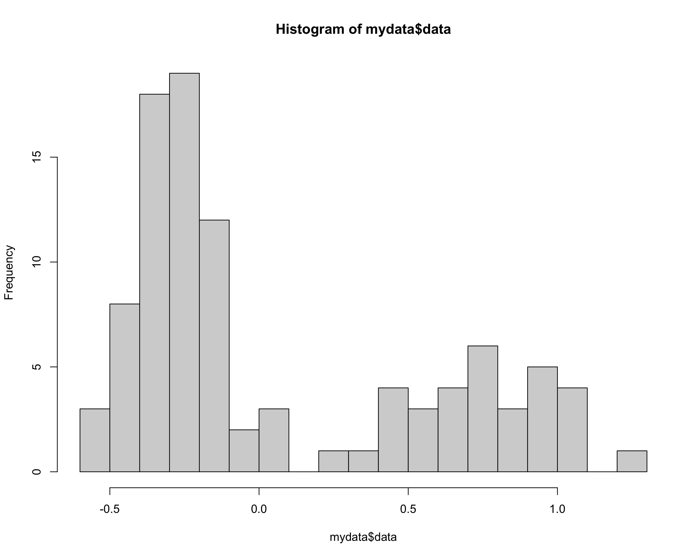
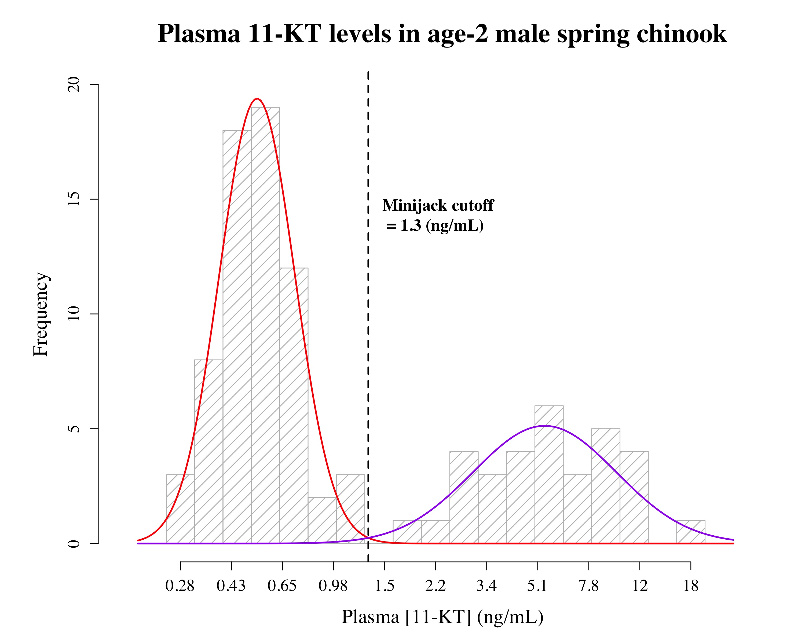

<!-- README.md is generated from README.Rmd. Please edit that file -->


# cutoffvalue

Cutoffvalue is a simple R package that implements an updated version of the method first developed and used in Medeiros et al. (2018). It can be used to determine an objective cutoff value between a significantly bimodal distribution of log-transformed data and plot a representative graph of the results.

## Installation

You can install the development version of cutoffvalue from [GitHub](https://github.com/lea-medeiros/cutoffvalue.git) with:

``` r
# install.packages("devtools")
devtools::install_github("lea-medeiros/cutoffvalue", dependencies = TRUE, build_vignettes = TRUE)
```

## Example

This is a basic example which shows you how to use the cutoffvalue package.

### Setup RStudio

Load the packages that are used by this package.


``` r
library(cutoffvalue)
library(mixtools)
library(Hmisc)
library(plyr)
library(multimode)
library(readxl)
```

### Define your raw dataset

Specify the data file to be used in the analyses and graph (if located in root folder of an R project, path information is not necessary). Reminder: data should be organized in as a single column of log- or natural log-transformed data without a column header.


``` r
rawdata <- "R/exampledata.xlsx"
```

*This step isn't necessary if you'd rather use the path name for your data.*

### Import the raw dataset

Import data and remove rows containing NA data. This function also defines minimum and maximum values for the dataset. The default for each function is specified as "R/exampledata.xlsx", meaning that running any function without specifying the dataset will use the exampledata.xlsx file.


``` r
rawdata <- "R/exampledata.xlsx"
mydata <- importdata(rawdata)
```

*Alternatively, you could enter the path name of your data in the read_excel function*

### Determine modality

Determine if the data is not unimodal (e.g., bimodal). This function also returns the Excess Mass statistic and associated p-value in the Environment.


``` r
rawdata <- "R/exampledata.xlsx"
modetest <- modes(rawdata)
## Modality Test Results
## 
## P-value: 0.01 
## Excess Mass Statistic: 0.09845028 
## **Reject null hypothesis** Distribution contains more than one mode; proceed with analyses.
## 
## Test Credit: Ameijeiras-Alonso et al. (2019) excess mass test
```

*Returns excess mass statistic and p-value. If the p-value is less than 0.05, accept the alternative hypothesis (data is more than unimodal) and proceed with analysis. However, if the p-value is more than 0.05, the data is unimodal and the following analyses are not entirely valid.*

### Fit a model to the data

Fit the two component mixture models to the data and plot a rough histogram with the fitted lines. It also defines the index.lower value to be used in the find.cutoff function.


``` r
rawdata <- "R/exampledata.xlsx"
model <- datamodel(rawdata)
```


*Make sure things look right, but won’t actually use this graph as it plots on a density scale and may cause confusion. However, this should look pretty spot on (final graph will just be scaled up by a constant determined later on), so make sure that the point where the two curves intersect is where you are expecting the cutoff to be.*

### Determine the cutoff value

Determine the cutoff value between the two populations that has an equal chance of being drawn from either mode. The default is 0.5, but the probability can be changed in the code.


``` r
rawdata <- "R/exampledata.xlsx"
cutoff <- findcutoff(rawdata)
## number of iterations= 21
## Cutoff Value: 0.1124711
```

*The uniroot lower and upper values are determined using the range of "mydata" and will reflect the dataset being analyzed. If there are errors due to the uniroot, consider editing the custom values to something that more generally reflects the range of the data being analyzed.*

### Basic histogram and parameters

The code below will produce basic histogram of data used for the parameters it produces; alter number of breaks to reflect what you would like to see in the final graph. Then, use various parameters to define variables for the final graph


``` r
rawdata <- "R/exampledata.xlsx"
fit <- fitparams(rawdata)
```



### Create curves

Determine x and y values to calculate the points for the curves to represent the generated models


``` r
rawdata <- "R/exampledata.xlsx"
curves <- curves(rawdata)
```

*Creates curves using model parameters*

### Plot the graph

Plot a pretty graph - SOME OF THE FOLLOWING WILL NEED TO BE TWEAKED TO FIT YOUR DATA/PREFERENCES!!! If nothing is specified in the plot function, then these are used.

#### Specify graph labels


``` r
title <- "Plasma 11-KT levels in age-2 male spring chinook"  # Graph title
xlab <- "Plasma [11-KT] (ng/mL)" # X-axis label
cutofflab <- "Minijack cutoff" # label for cutoff value on graph
cutoffunits <- "(ng/mL)" # units for cutoff value
LowerMode_col <- "red" # line color for the lower mode
LowerMode_lty <- 1 # line type for the lower mode
LowerMode_lwd <- 2 # line width for the lower mode
UpperMode_col <- "purple" # line color for the upper mode
UpperMode_lty <- 1 # line type for the upper mode
UpperMode_lwd <- 2 # line width for the upper mode
cutoffvalue_col <- "black" # line color for the cutoff value
cutoffvalue_lty <- 2 # line type for the cutoff value
cutoffvalue_lwd <- 2 # line width for the cutoff value
```

#### Plot the graph


``` r
rawdata <- "R/exampledata.xlsx"
plotty <- cutoffplot(rawdata, title, xlab, cutofflab, cutoffunits, LowerMode_col, LowerMode_lty, LowerMode_lwd, UpperMode_col, UpperMode_lty, UpperMode_lwd, cutoffvalue_col, cutoffvalue_lty, cutoffvalue_lwd)
```



*All figures can be found in the "cutoffvalue_figures" folder. They are exported as PDF, JPEG, and PNG at 300 dpi.*
